a como um todo. Em seguida, esse sistema é apresentado em um [DFD de nível 0][DiagDFDNivel0] em que demonstra seus processos. A partir daí, são gerados outros diagramas de maiores níveis que permitem se aprofundar cada vez mais no funcionamento de cada um dos processos.

### DFD - Diagrama de contexto

> É o primeiro DFD de qualquer processo operacional. Mostra o contexto no qual o processo se enquadra.
>
> Elementos:
>
> - Um único processo: o próprio sistema (ou subsistema)
> - As entidades externas: as que interagem com o sistema
> - Os fluxo de dados que chegam e saem das entidades externas
>
> Sistema como um todo

[Nesse diagrama][ImgDFDContexto] são apresentadas as interações que ocorrem entre os agentes externos e o sistema. Sendo elas a troca de informações envolvendo cadastro e modificação dos dados referentes à contas de usuário e itens.

#### Diagrama DFD de Contexto

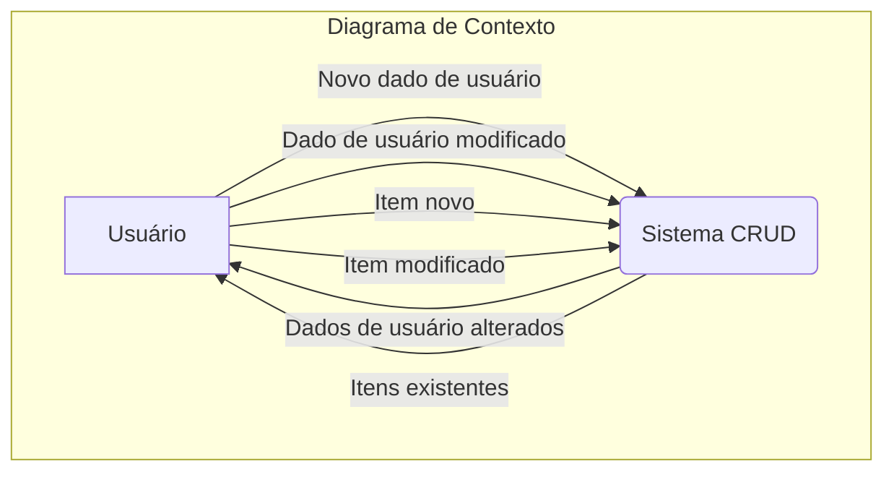

### DFD - Nível 0

> Sistema completo como um conjunto de processos

O sistema nível 0 acaba sendo o segundo diagrama na estratégia Top-Down e apresenta o sistema apresentado no [Diagrama de Contexto][DiagDFDContexto] decomposto em diversos processos que serão mais detalhados nos níveis superiores.

Este diagrama mostra com mais detalhes de que forma os processos internos do sistema interagem entre si e com o usuário. Mostra também suas interações com o banco de dados.

Os dois processos mostrados no [Diagrama DFD Nível 0 do sistema][ImgDFDNivel0] são referentes a modificação dos dados de usuário e de itens. Ambos recebendo informações do usuário e salvando-as no banco de dados.

#### Diagrama DFD Nível 0

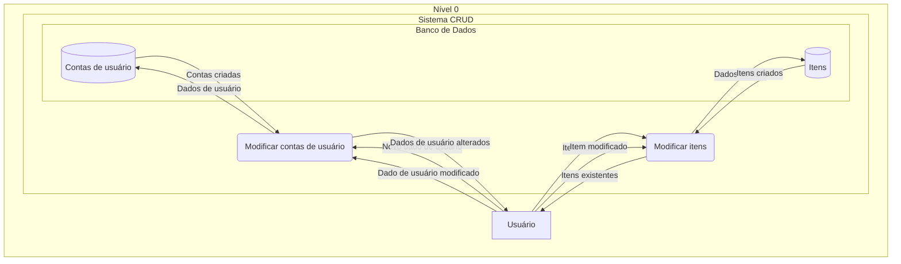

### DFD - Nível 1 - Modificar contas de usuário

[Neste diagrama][ImgDFDNivel1.1] é exemplificado o fluxo dos dados durante um cadastro de conta feito pelo usuário. Nele, inicialmente o Usuário informa o seu nome e senha na página de cadastro. A página encaminhará esses dados para a validação que checará se o nome pretendido está disponível. Caso esteja, a conta será criada, armazenada no banco de dados e será informado ao usuário que sua conta foi criada. Caso contrário, o usuário receberá uma mensagem de que o nome já existe e que a conta não foi cadastrada.

A modificação de dados do usuário, exemplificada abaixo pela solicitação de mudança do nome de usuário ou senha, ou qualquer outro dado, passa por um processo similar ao do cadastro.

O usuário informa qual dado quer modificar e qual o novo valor. O sistema verifica a validade desse novo valor. Caso seja válido, é modificado no banco de dados e o sistema informa o sucesso ao usário, caso contrário, apenas informa qual a falha ocorrida na modificação.

#### Diagrama DFD Nível 1: Modificar contas de usuário

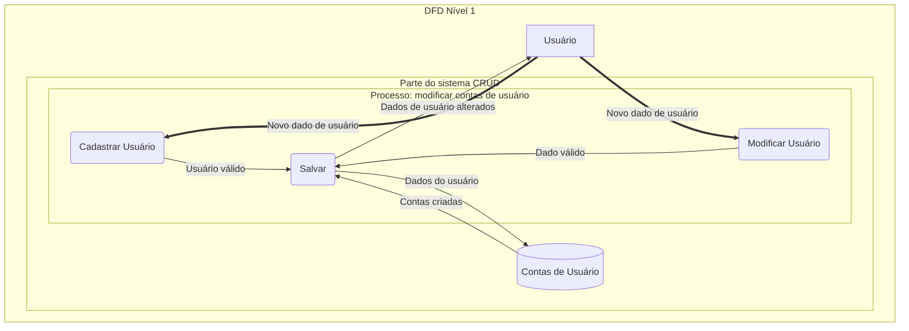

### DFD - Nível 1 - Modificar itens

O fluxo de dados para a modificação de itens, representado pelo [diagrama abaixo][ImgDFDNivel1.2], segue uma rota muito similar a de modificação de dados da conta de usuários. Assim como no diagrama anterior, os mesmos passos genéricos são realizados:

> O usuário informa qual dado quer modificar e qual o novo valor. O sistema verifica a validade desse novo valor. Caso seja válido, é modificado no banco de dados e o sistema informa o sucesso ao usário, caso contrário, apenas informa qual a falha ocorrida na modificação.

#### Diagrama DFD Nível 1: Modificar itens

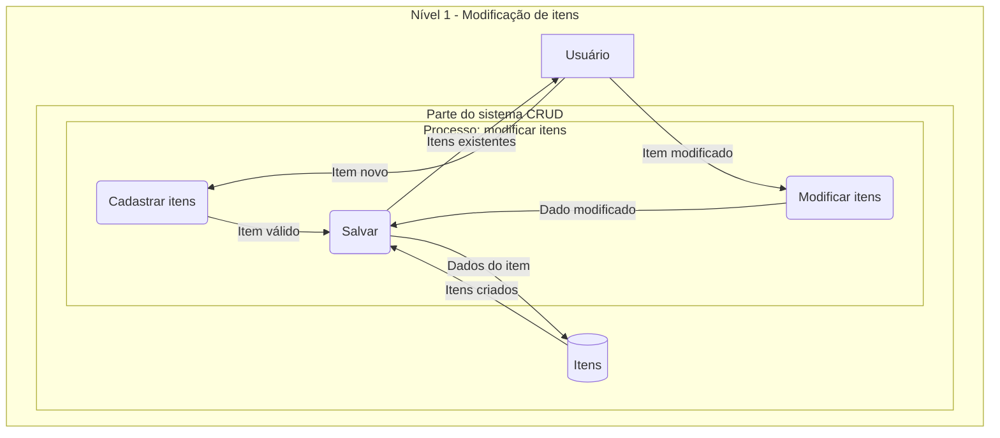

## [Diagramas de Entidade e Relacionamento (ER) (1)][LinkMermaidER]

Outro é diagrama é o de Entidade e Relacionamento ele...

> É um modelo que mostra as informações que são criadas, armazenadas e usadas pelo sistema
> Um diagrama entidade-relacionamento é a representação de um modelo que é usado para ajudar o desenvolvimento de um banco de dados

Ele é composto por entidades:

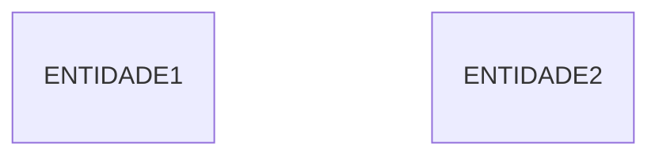

> - É a representação de um objeto do mundo real
> - Permite distinguir um objeto de outro
> - Tem um nome singular escrito em letras maiúsculas
> - Tem um identificador, que é a maneira de localizar informações na entidade
> - Contém diversas instâncias ou ocorrências de dados

Por atributos contidos nas entidades:

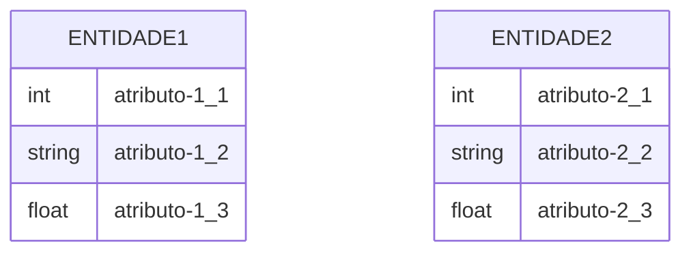

> - Informações básicas que permitem descrever a entidade
> - Propriedades comuns a um conjunto de entidades

E também por relacionamentos entre elas...

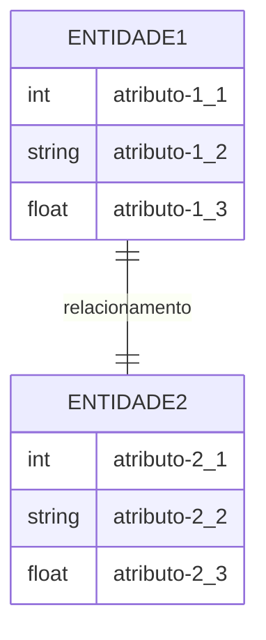

### ER - Modelo Conceitual

> Informações (dados) sobre modelos conceituais são obtidas a partir dos requisitos de negócios. Os atributos dos dados não são fixados. É o primeiro modelo.

No [diagrama abaixo][ImgERConceitual] são demonstrados os relacionamentos entre as entidades. Nesse caso, o USUÁRIO se relaciona apenas com as entidades CONTA e ITEM. Com a CONTA ele a "tem", "cadastra" e "modifica". Já com ITEM, o USUÁRIO o "cadastra" e "modifica".

#### Imagem do diagrama: ER - Modelo Conceitual

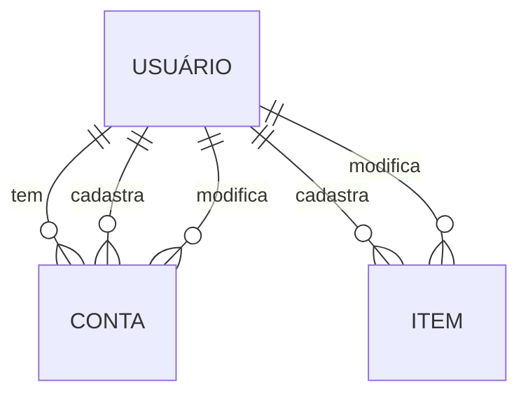

### ER - Modelo Lógico

> Informações sobre modelos lógicos também são obtidas a partir dos requisitos de negócios, porém, os atributos (colunas) são fixadas (detalhados)

No [diagrama abaixo][ImgERLogico] são demonstrados os relacionamentos entre as entidades anteriores, bem como uma nova entidade chamada CADASTRO que serve de intermediária entre o USUÁRIO e a criação de uma CONTA.

Além disso, o [diagrama][ImgERLogico] também apresenta os atributos das entidades:

- A entidade **ITEM** possui os atributos "nome", "quantidade" e "prioridade", respectivamente dos tipos *string*, *float* e *int*.
- A entidade **CADASTRO** possui os atributos "nomeDoUsuario" e "senha", ambos do tipo *string*.
- A entidade **CONTA** possui os atributos "nomeDoUsuario", "senha" e "email", todos do tipo *string*. Ele também apresenta o atributo "dataDeCriacao" que tem o tipo *date*.

#### Imagem do diagrama: ER - Modelo Lógico

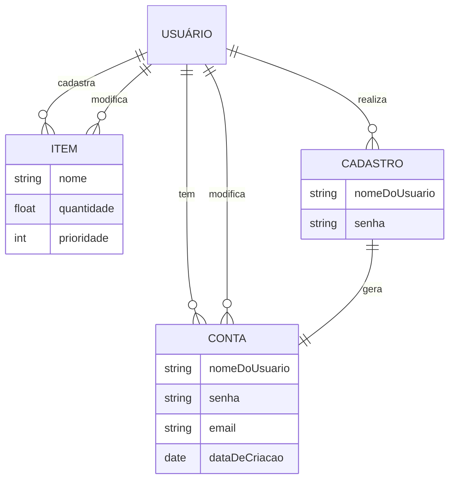

### ER - Modelo Físico

> - Representa o projeto real (banco de dados) a ser implementado.
>
> - Ele representa como os dados devem ser estruturados e relacionados em um SGBD específico, por isso é importante considerar a convenção e a restrição do SGBD que vai se usar ao projetar um DER físico. Isso significa que um uso preciso do tipo de dados é necessário para colunas de entidade e o uso de palavras reservadas deve ser evitado ao nomear entidades e colunas. Além disso, os projetistas de banco de dados também podem adicionar chaves primárias, chaves estrangeiras e restrições ao projeto.

A difença do [diagrama abaixo][ImgERFisico] para o anterior, é que o atual apresenta algumas características quanto a atributos das entidades que não foram previamente citados, visto que agora deve ser considerado o que será de fato implementado.

Sendo assim, ocorreram as seguintes mudanças:

- À entidade **ITEM** foi adicionado um atributo "UUID" do tipo *string*, e que será a chave primária. Já o atributo "prioridade" pode ter valor nulo.

- À entidade **CONTA** foi informado que o atributo "nomeDoUsuario" será a chave primária.

- À entidade **CADASTRO** foi informado que o atributo "nomeDoUsuario" será a chave primária. E que o atributo "email" poderá ser nulo.

#### Imagem do diagrama: ER - Modelo Físico

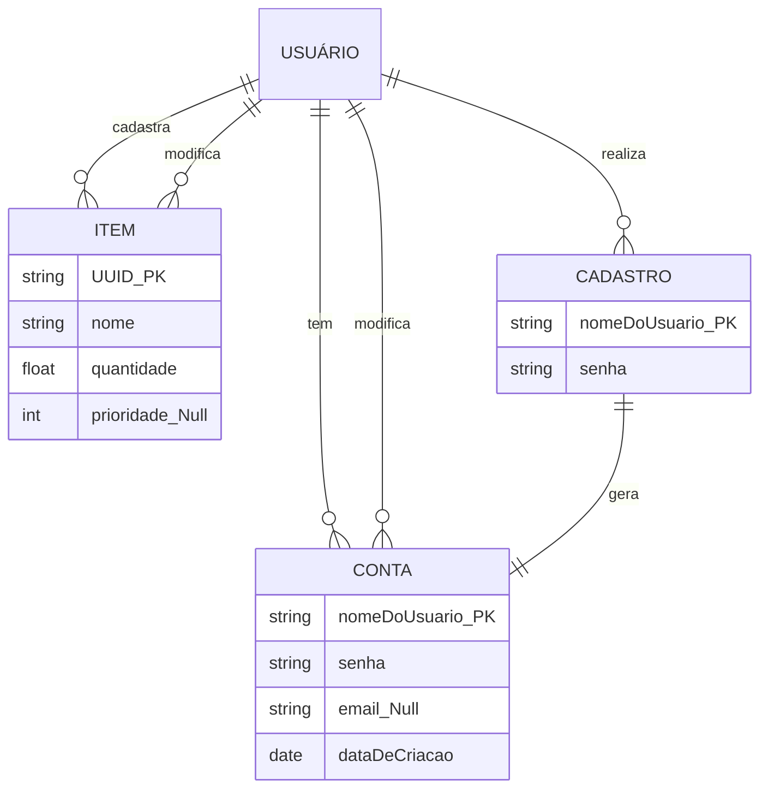

#### Código do diagrama: ER - Modelo Físico

Abaixo está demontrado o código em MySql representando a criação do banco de dados:

```sql
CREATE TABLE ITEM (
    UUID VARCHAR(255) PRIMARY KEY,
    nome VARCHAR(255),
    quantidade FLOAT,
    prioridade INT NULL
);

CREATE TABLE CONTA (
    nomeDoUsuario VARCHAR(255) PRIMARY KEY,
    senha VARCHAR(255),
    email VARCHAR(255) NULL,
    dataDeCriacao DATE
);
```

## UML Diagrams

<!-- Chat GPT -->
> O UML é uma linguagem de modelagem gráfica que é usada para desenhar diagramas que representam sistemas de software. Ele é amplamente utilizado em desenvolvimento de software para ajudar a visualizar, especificar, construir e documentar os aspectos de um sistema de software. O UML inclui uma variedade de diagramas diferentes, cada um com um propósito específico, como diagramas de classes, diagramas de sequência, diagramas de atividade e diagramas de estado.
>
> "UML Distilled: A Brief Guide to the Standard Object Modeling Language, Third Edition" é um livro que fornece uma introdução ao UML e explica como usá-lo para modelar sistemas de software. Ele é escrito por Martin Fowler e Kendall Scott e foi publicado pela Addison-Wesley em 2004.

### Diagramas de estrutura

<!-- Chat GPT -->
> Os diagramas UML de estrutura são usados ​​para visualizar a estrutura de um sistema de software. Eles mostram como os elementos de um sistema, como classes, interfaces, pacotes e componentes, são relacionados uns com os outros e como eles trabalham juntos para implementar as funcionalidades do sistema.
>
> Existem vários tipos diferentes de diagramas UML de estrutura, cada um com um propósito específico:
>
> - **Diagramas de Classes**: mostram as classes em um sistema e como elas estão relacionadas entre si através de herança, agregação e associação.
> - **Diagramas de Pacotes**: mostram como os elementos de um sistema são organizados em pacotes e como esses pacotes interagem uns com os outros.
> - **Diagramas de Componentes**: mostram como os elementos de um sistema são divididos em componentes e como esses componentes são interconectados para formar o sistema completo.
> - **Diagramas de Deployment**: mostram como os elementos de um sistema são implementados em um conjunto de nós de deploy e como eles são interconectados através de redes.
>
> Esses são apenas alguns exemplos de diagramas UML de estrutura. Há muitos outros tipos de diagramas de estrutura disponíveis, cada um com suas próprias convenções e usos específicos.

#### [Class (1)][LinkMermaidClass]

<!-- BEBETO -->
> É uma das principais e populares diagramas UML
>
> É um diagrama estrutural
>
> - Descrevem a arquitetura de uma aplicação
> - Permite visualizar e documentar a estrutura da aplicação
> - Permite construir o sistema através de engenharia de código fonte e reverso
>
> Descreve a estrutura lógica estática do sistema
> Uma classe é uma categoria ou grupo de objetos que tem os atributos similares e comportamentos comuns
> Os elementos de uma classe UML:
>
> - Nome
> - Atributos
> - Operações
<!-- ChatGPT -->
> O diagrama UML de classes é um tipo de diagrama UML que é usado para modelar a estrutura de um sistema de software. Ele mostra as classes em um sistema e como elas estão relacionadas entre si através de herança, agregação e associação.
>
> Um diagrama UML de classes é composto por um conjunto de caixas, chamadas de "classes", que representam os elementos do sistema. Cada classe é dividida em três partes:
>
> - **Nome da classe**: o nome da classe é exibido no topo da caixa da classe e é usado para identificar a classe no diagrama.
> - **Atributos**: os atributos da classe são exibidos na parte inferior da caixa da classe e representam as informações que a classe armazena.
> - **Métodos**: os métodos da classe são exibidos na parte inferior da caixa da classe e representam as ações que a classe pode realizar.
>
> As classes são conectadas por linhas que representam relacionamentos entre as classes. Existem vários tipos de relacionamentos que podem ser mostrados em um diagrama UML de classes, incluindo:
>
> - **Generalização**: uma linha tracejada com um triângulo no final indica que uma classe está herdando de outra classe.
> - **Agregação**: uma linha tracejada com um diamante no final indica que uma classe é composta por outra classe.
> - **Associação**: uma linha simples indica que as duas classes estão associadas de alguma forma, mas não há relação de composição ou herança entre elas.
>
> Os diagramas UML de classes são amplamente utilizados em desenvolvimento de software para ajudar a visualizar e documentar a estrutura de um sistema de software. Eles são particularmente úteis para mostrar como as classes em um sistema estão relacionadas e como elas trabalham juntas para implementar as funcionalidades do sistema.

No diagrama de classes baixo, são representadas todas as classes utilizadas no sistema, em conjunto das relações apresentadas entre elas. A maior parte das clases é utilizada como objetos visuais da interface do usuário, possuindo cada uma delas seus atributos e métodos. Elas entre si tendem a estar contidas dentro uma das outras, por exemplo: ComponentePagina > Roteador > PaginaSobre > ComponenteCabecalho > ComponenteBarraDeNavegacao. Todas elas estão uma contida pela outra.

##### Imagem do diagrama: UML - Structure - Class

```mermaid
classDiagram
    class EstilosCSS{
        + EstiloComponenteCabecalho
        + EstiloComponenteBarraDeNavegacao
        + EstiloComponenteRodape
        + EstiloComponenteItem
        + EstiloComponentePagina
        + EstiloRoteador
        + EstiloPaginaSobre
        + EstiloPaginaContaLogin
        + EstiloPaginaContaCadastro
        + EstiloPaginaContaModicacao
        + EstiloPaginaItemAdicaoModificacao
    }
    class ComponenteCabecalho{
        - ObterLogo(): string
        - ObterBarraDeNavegação(): Component
    }
    class ComponenteBarraDeNavegacao{
        - ObterBotaoDePagina(DadosBotao: object): Component
        - ObterListaDeBotoes(): objectList[]
    }
    class ComponenteRodape{
        - ObterTextoBase()
        - TextoBase: string = "Texto Padrão"
    }
    class ComponenteImagens{
        + ObterImagensBase64(): objectList[]
    }
    class ComponenteTitulo{
        - Construtor(
            TextoDoTitulo: string = "Texto Padrão"
        )
        - ObterComponenteTitulo(): component
    }
    %% Essa página abstrata me parece meio estranha
    class ComponentePagina{
        - Construtor(
            TextoDoTitulo: string = "Texto Padrão"
        )
        - ObterPagina(): component
    }
    class Roteador{
        - ObjectList: list = []
        - ObterComponenteRoteador(): component
    }
    class PaginaSobre{
        - TextoApresentacao: string = "Texto Padrão"
        - ObterComponentePaginaSobre(): component
    }
    class ValidacaoDeConta {
        - ValidarUsuario(NomeDeUsuario: string): bool = false
        - ValidarSenha(Senha: string): bool = false
    }
    class PaginaContaLogin{
        - NomeDeUsuario: string = ""
        - Senha: string = ""
        - DadosDeUsuario: object
        - Constructor()
        - ValidarLogin(DadosDeusuario: object): bool = false
        - AtualizarNomeDeUsuario(NovoNomeDeUsuario: string)
        - AtualizarSenha(NovaSenha: string)
        - ObterComponentePaginaContaLogin(): component
    }
    class PaginaContaCadastro{
        - NomeDeUsuario: string = ""
        - Senha: string = ""
        - DadosDeUsuario: object
        - Constructor()
        - AtualizarNomeDeUsuario(NovoNomeDeUsuario: string)
        - AtualizarSenha(NovaSenha: string)
        - ArmazenarCadastroDeUsuario(DadosDeUsuario: object): bool = false
        - ObterComponentePaginaContaCadastro(): component
    }
    class PaginaDadosUsuario{
        - DadosDoUsuario: object
        - ObterDadosDoUsuario (NomeDeUsuario: string): object
        - ObterComponenteTabelaDeDados(DadosDoUsuario: object): component
        - ObterComponentePaginaDadosUsuario(): component
    }
    class ComponenteItem{
        - Imagem: string
        - Nome: string
        - Quantidade: float
        - Prioridade: int
        - Construtor(
            %% Imagem: string = "Imagem Padrão",
            Nome: string = "Nome Padrão",
            Quantidade: float = 1.23,
            %% Prioridade: int = 4
        )
        - ObterComponenteItem(): component
    }
    class PaginaItens{
        - ObterDadosDoItem(): object
        - ArmazenarCadastroDeItem(DadosDoItem: object): bool = false
        - ArmazenarModificacaoDeItem(DadosDoItem: object): bool = false
        - ObterComponentePaginaItens(): component
    }

    ComponentePagina <|-- PaginaContaCadastro: herda
    ComponentePagina <|-- PaginaDadosUsuario: herda
    ComponentePagina <|-- PaginaContaLogin: herda
    ComponentePagina <|-- PaginaSobre: herda
    ComponentePagina <|-- PaginaItens: herda

    ValidacaoDeConta <|-- PaginaContaCadastro: herda
    ValidacaoDeConta <|-- PaginaContaLogin: herda

    Roteador "1"--"1" PaginaContaCadastro: contém
    Roteador "1"--"1" PaginaDadosUsuario: contém
    Roteador "1"--"1" PaginaContaLogin: contém
    Roteador "1"--"1" PaginaSobre: contém
    Roteador "1"--"1" PaginaItens: contém

    ComponentePagina "1..*"--"1" ComponenteCabecalho: contém
    ComponentePagina "1..*"--"1" ComponenteTitulo: contém
    ComponentePagina "1..*"--"1" ComponenteRodape: contém

    ComponenteCabecalho "1"--"1" ComponenteBarraDeNavegacao: contém
    PaginaItens "1..*"--"0..*" ComponenteItem: contém
```

### Diagramas de Comportamento

<!-- CHAT GPT -->
> Os diagramas UML de comportamento dinâmico são usados ​​para modelar o comportamento de um sistema ao longo do tempo e como as entidades do sistema interagem entre si. Eles são úteis para visualizar e entender como um sistema funciona e como ele responde a eventos externos e internos.
>
> Existem vários tipos de diagramas UML de comportamento dinâmico, incluindo:
>
> **Diagrama de Caso de Uso:** mostra as interações entre um sistema e seus atores (usuários ou outros sistemas) ao longo do tempo para cumprir um objetivo específico.
> **Diagrama de Sequência:** mostra as mensagens trocadas entre objetos em um sistema em ordem cronológica.
> **Diagrama de Atividade:** mostra as atividades que ocorrem em um sistema e como elas estão relacionadas entre si.
> **Diagrama de Estado:** mostra os diferentes estados que um objeto pode assumir e as ações que ocorrem quando o objeto muda de um estado para outro.
> **Diagrama de Colaboração:** mostra como os objetos em um sistema colaboram entre si para realizar uma tarefa.
>
> Os diagramas UML de comportamento dinâmico são geralmente usados ​​em conjunto com outros tipos de diagramas UML, como os diagramas de estrutura, para fornecer uma visão completa do sistema. Eles são úteis para comunicar o comportamento esperado de um sistema para os desenvolvedores de software, bem como para ajudar os gerentes de projeto a gerenciar e planejar o desenvolvimento de um sistema.

Neste documento, serão apresentados estes diagramas referentes ao sistema proposto.

#### **Casos de Uso** <!-- (5) -->

<!-- CHAT GPT -->
> O diagrama de caso de uso é um tipo de diagrama UML de comportamento dinâmico que mostra as interações entre um sistema e seus atores (usuários ou outros sistemas) ao longo do tempo para cumprir um objetivo específico. Ele é usado para visualizar e entender como um sistema é usado e como ele responde a diferentes cenários de uso.
>
> Um caso de uso é uma sequência de eventos que ocorrem quando um ator interage com o sistema para cumprir um objetivo. Cada caso de uso é representado por uma forma oval no diagrama. Os atores são representados por formas retangulares e são os usuários ou outros sistemas que interagem com o sistema. As setas representam as mensagens trocadas entre os atores e o sistema.
>
> O diagrama de caso de uso é útil para comunicar o comportamento esperado de um sistema para os desenvolvedores de software e para ajudar os gerentes de projeto a planejar o desenvolvimento do sistema. Ele também pode ser usado para identificar os requisitos do sistema e para documentar as possíveis ramificações e exceções em cada caso de uso.

##### Casos de uso gerais

O [diagrama abaixo][ImgUMLBehavUseCaseGeral] apresenta em uma visão geral as funcionalidades do sistema que podem ser acessadas pelos usuários. Diversas funções como por exemplo:

- Cadastrar conta
- Deletar conta
- Pesquisar itens
- Adicionar itens
- Modificar dados dos itens
- Modificar senha

Além de diversos outros.

Casos mais específicos serão mais profundamente apresentados nos diagramas seguintes.

###### Imagem do diagrama: Casos de uso gerais

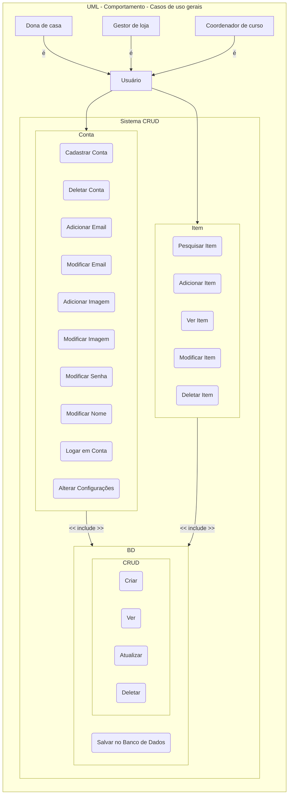

##### Subsistema de conta

O [diagrama abaixo][ImgUMLBehavUseCaseEspecificoConta] ilustra as funcionalidades mais específicas do subsistema de conta. Como por exemplo as subcategorias de itens que podem ser modificados como o "Subsistema de Email" e o "Subsistema de Imagem".

###### Imagem do diagrama: Casos de uso Específicos - Conta

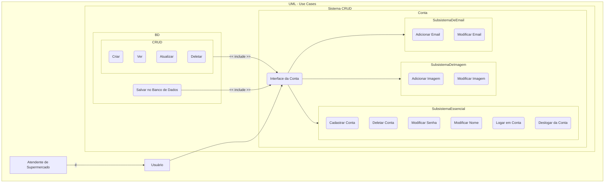

##### Subsistema de item

No [diagrama abaixo][ImgUMLBehavUseCaseEspecificoItem] são especificadas as funcionalidades que envolvem os itens. Mais especificamente, o fato de que as manipulações de itens envolvem todos os itens do [CRUD][LinkCRUD]: criar, ler, atualizar e deletar. Além disso, é também possível pesquisar por itens específicos.

###### Imagem do diagrama: Casos de uso Específicos - Item

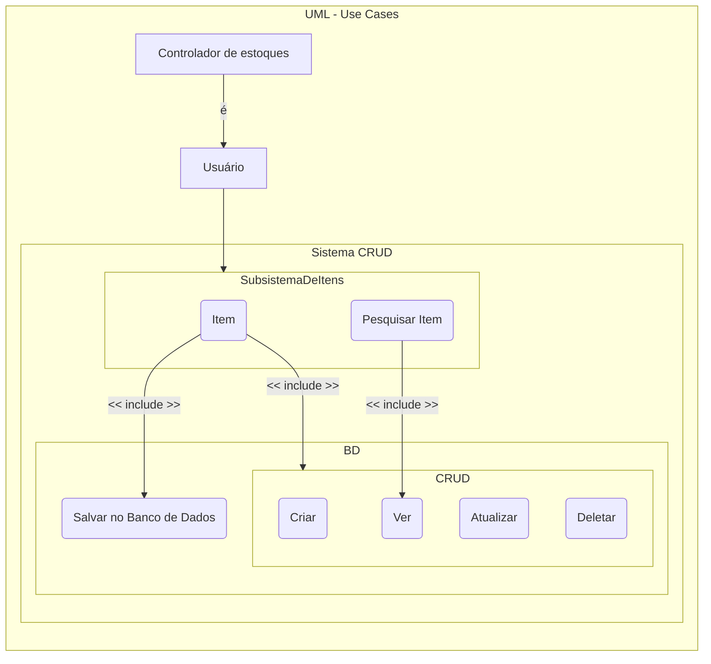

##### Subsistema de configurações

Neste [diagrama][ImgUMLBehavUseCaseEspecificoConfigurações] são mostradas algumas configurações disponíveis aos usuários. Sendo elas a possibilidade de alterar o idioma do sistema entre inglês e português e a de alterar o tema, podendo ele ter a temática clara ou escura.

###### Imagem do diagrama: Casos de uso Específicos - Configurações

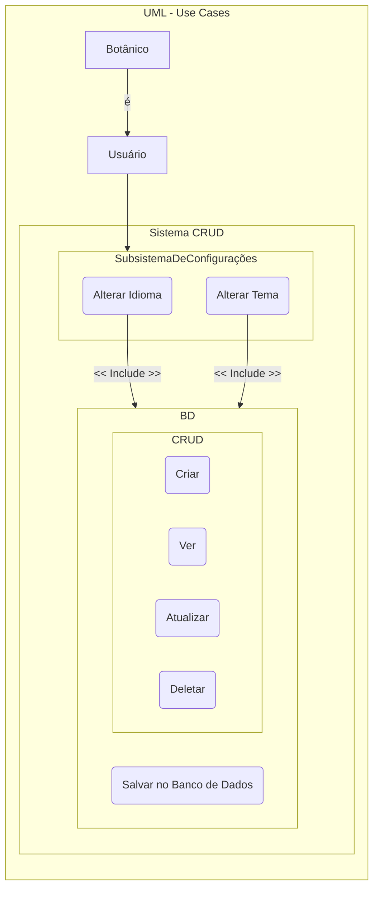

##### Subsistema de login

Com o [diagrama][ImgUMLBehavUseCaseEspecificoLogin] é mostrado o subsistema de login. Tanto o login quanto o Cadastro necessitam apenas da inserção do nome e da senha. Mas para isso, requerem o acesso ao banco de dados.

###### Imagem do diagrama: Casos de uso Específicos - Subsistema de Login

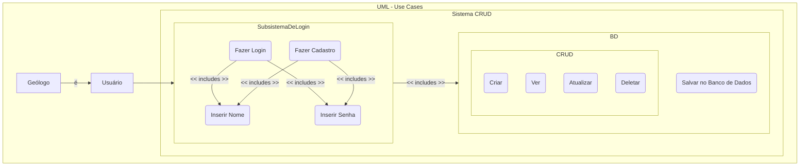

#### [**Sequência**][LinkMermaidSequence] <!-- (3) -->

<!-- CHAT GPT -->
> O diagrama de sequência do UML (Unified Modeling Language) é um tipo de diagrama que representa as interações entre os objetos em um sistema em um determinado momento. Ele é usado para visualizar e documentar a sequência de mensagens que são trocadas entre os objetos em um sistema ao longo do tempo.
>
> O diagrama de sequência é composto por linhas verticais que representam os objetos envolvidos na interação, e linhas horizontais que representam as mensagens trocadas entre esses objetos. As mensagens são representadas por setas que apontam do objeto que envia a mensagem para o objeto que a recebe.
>
> O diagrama de sequência também pode conter outros elementos, como condições, loops e operações, que podem ser usados para representar as lógicas de negócio envolvidas na interação.
>
> O diagrama de sequência é muito útil para visualizar e entender como os objetos em um sistema interagem entre si e como essas interações afetam o comportamento do sistema. Ele é amplamente utilizado na engenharia de software para especificar e documentar os requisitos de sistema.

##### Cadastro, Login e Autenticação de conta

No [de Cadastro, Login e Autenticação de conta][ImgUMLComportamentoSequencia1], é mostrada a sequência esperada de um comportamento padrão de usuário ao tentar efetuar o login e cadastro. Inicialmente ele começa informando os seus dados de login, sendo eles o nome e a senha. A aplicação confere com o Banco de Dados se os dados já existem. Se existirem, o usuário estará logado. Senão, o usuário será informado de que a conta não existe e então indagado se deseja criar a conta uma conta com esses dados. Caso deseje criar a conta, a aplicação enviará os dados ao banco que por sua vez os armazenará e retornará o resultado da operação. Caso tenha tido sucesso, caso seja sucesso, o usuário estará logado.

###### **Imagem do diagrama: UML - Sequência - Cadastro, Login e Autenticação de conta**

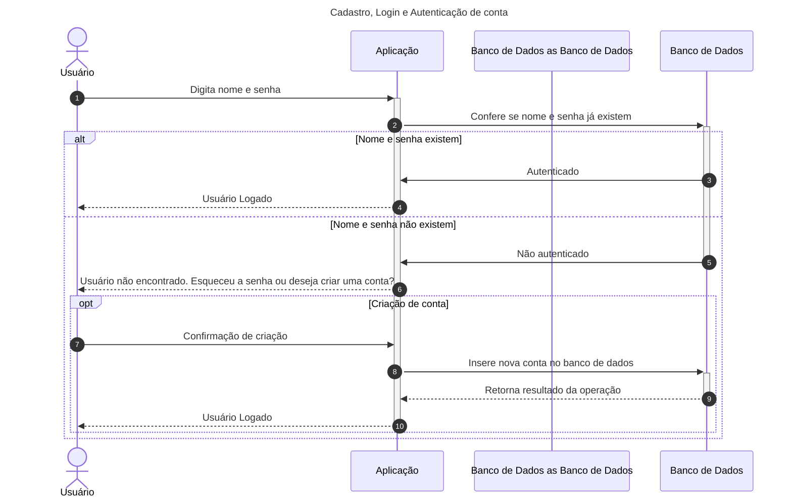

##### Cadastro e modificação de itens

[Esse diagrama][ImgUMLComportamentoSequencia2] mostra o fluxo de dados para o cadastro e modificação de itens em um banco de dados. O usuário envia uma requisição de cadastro ou modificação de item para a aplicação, que, por sua vez, envia a requisição para o banco de dados. O banco de dados processa a requisição e retorna o resultado da operação para a aplicação, que por fim exibe o resultado para o usuário.

###### **Imagem do diagrama: UML - Sequência - Cadastro e modificação de itens**

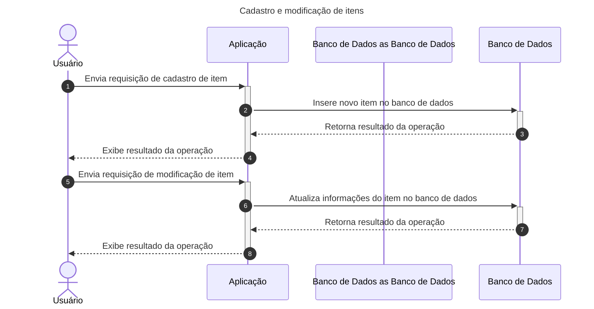

##### Pesquisa de itens

No [diagrama de Pesquisa de itens][ImgUMLComportamentoSequencia3] é ilustrada a forma como o usuário pode realizar uma pesquisa, através da interface da aplicação que o mostra uma listagem de itens, a fim de filtrar os itens mostrados apenas para alguns tipos específicos.

###### **Imagem do diagrama: UML - Sequência - Pesquisa de itens**

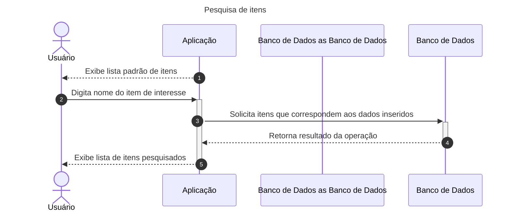

#### **Atividade** <!-- (3) -->

<!-- CHAT GPT -->
> O diagrama de atividades UML (Unified Modeling Language) é um tipo de diagrama utilizado para representar o fluxo de trabalho de um sistema ou processo. Ele é composto por atividades, decisões, gateways de ramificação e junção, assim como objetos de dados e eventos. As atividades são os passos que compõem o processo e podem ser representadas por círculos ou retângulos. As decisões são representadas por diamantes e representam pontos de ramificação no fluxo de trabalho, onde uma ação é tomada com base em uma condição específica. Os gateways de ramificação e junção são usados para controlar o fluxo de trabalho, permitindo que ele se ramifique em várias direções ou se junte novamente depois de ramificações separadas. Os objetos de dados são elementos externos que são usados ou modificados pelo processo, enquanto os eventos são gatilhos que desencadeiam ações no processo. O diagrama de atividades UML é útil para modelar e documentar processos de negócios, bem como para entender e melhorar os processos existentes.

##### Login e Cadastro

Abaixo há [um diagrama de atividades que representa um processo de login e cadastro][ImgUMLComportamentoAtividade1] no sistema. O diagrama mostra as etapas que o usuário deve seguir ao entrar ou se cadastrar na aplicação.
<!-- Chat GPT -->
> O processo começa no Início e termina no Final. O usuário é direcionado para a Tela de login, onde pode inserir o nome e a senha e tentar logar. Se o nome existir, o sistema tenta fazer o login. Se o nome não existir, o usuário é direcionado para a opção de cadastro.
>
> Para se cadastrar, o usuário deve inserir uma nova senha. Se a senha for inválida, o usuário é solicitado a inserir novamente. Se a senha for válida, o usuário é registrado e logado.
>
> Se o usuário tentar fazer login com uma senha inválida, ele pode optar por recuperar a senha ou tentar novamente. Se o usuário escolher recuperar a senha, o processo é encerrado. Se o usuário escolher tentar novamente, ele pode inserir a senha correta e logar.

###### **Imagem do diagrama: UML - Atividade - Login e Cadastro**

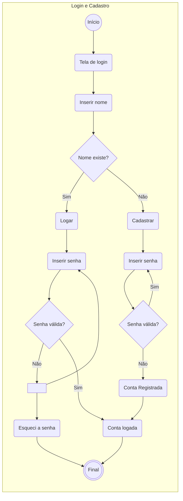

##### CRUD - Itens
<!-- Auxiliado pelo CHAT GPT -->
[Esse][ImgUMLComportamentoAtividade2] diagrama de atividade representa um processo de gerenciamento de itens da aplicação. O diagrama mostra as etapas que o usuário deve seguir para criar, ler, editar e excluir itens.

Inicialmente o usuário é direcionado para a "tela de itens", onde tem a opção de criar, ler, editar ou excluir itens. As opções de criar, editar e excluir são encaminhadas para um mesmo fim, enquanto a opção de ler é encaminhada para um outro.

Se o usuário escolher criar, editar ou excluir um item, o processo é encaminhado para a modificação do iem. Paralelamente, o usuário podera ter escolhido a opção de ler um item.

Em ambos os casos, logo em seguida, o usuário volta para a Tela de itens. Após o usuário finalizar as ações que deseja realizar nos itens, o processo é então encerrado.

###### **Imagem do diagrama: UML - Atividade - CRUD - Itens**

```mermaid

graph TB

subgraph CRUD - Itens

StartingPoint((Início))
EndingPoint(((Final)))
ItemScreen(Tela de itens)
Create(Criar)
Read(Ler)
Updade(Editar)
Delete(Deletar)
ItemModify(Modificar item)
Parallel1[ ]
Parallel2[ ]
Parallel3[ ]

StartingPoint   -->| | ItemScreen
ItemScreen      -->| | Parallel1
Parallel1       -->| | Read
Parallel1       -->| | Create
Parallel1       -->| | Updade
Parallel1       -->| | Delete
Create          -->| | Parallel2
Updade          -->| | Parallel2
Delete          -->| | Parallel2
Parallel2       -->| | ItemModify
ItemModify      -->| | Parallel3
Read            -->| | Parallel3
Parallel3       -->| | ItemScreen
ItemScreen      -->| | EndingPoint

end

```

##### Modificação de configurações
<!-- Auxiliado pelo Chat GPT -->

[Este][ImgUMLComportamentoAtividade3] é um diagrama de atividades que representa um processo de configuração do sistema. O diagrama mostra as etapas que o usuário deve seguir para alterar a linguagem e o tema da aplicação.

O usuário é direcionado para a "tela de configurações", onde tem a opção de alterar a linguagem ou o tema. As opções de alterar a linguagem e o tema são encaminhadas para um fluxo de trabalho paralelo.

Em ambos os casos, o usuário é encaminhado de volta à "tela de configurações" onde poderá finalizar o fluxo da atividade desejada.

###### **Imagem do diagrama: UML - Atividade - Modificação de configurações**

```mermaid

graph TB

subgraph Modificação de configurações


StartingPoint((Início))
EndingPoint(((Final)))

AlterLanguage(Alterar linguagem)
AlterTheme(Alterar tema)
ConfigScreen(Tela de configurações)

Parallel1[ ]
Parallel2[ ]

StartingPoint -->| | ConfigScreen
ConfigScreen -->| | Parallel1
Parallel1 -->| | AlterLanguage
Parallel1 -->| | AlterTheme
AlterLanguage -->| | Parallel2
AlterTheme -->| | Parallel2
Parallel2 -->| | ConfigScreen
ConfigScreen -->| | EndingPoint

end
```

#### [**State Machine**][LinkMermaidState] <!-- (3) -->

State Machine Diagrams

```mermaid

stateDiagram-v2
    [*] --> Still
    Still --> [*]

    Still --> Moving
    Moving --> Still
    Moving --> Crash
    Crash --> [*]
```

## To Do

Esta seção apresenta diversas tarefas que ainda pretendo realizar ou ao menos ponderei sobre fazer.

### To Do List

- [ ] Corrigir todos os links
- [ ] Corrigir a linguagem utilizada
  - [ ] Tornar mais formal
  - [ ] Colocar tudo em português
  - [ ] Remover texto do Chat GPT e adicionar meu próprio (?)
- [ ] Falar mais sobre o meu programa em específico e menos sobre as coisas gerais dos diagramas.
- [ ] Adicionar referências
- [x] Introdução
  - [x] Corrigir formatação
- [ ] Diagramas
  - [ ] Tornar a maioria dos elementos clicáveis
    - [ ] Os elementos que forem clicáveis, devem ter uma cor diferente
- [ ] DFD
  - [ ] Checar se os diagramas e textos ainda estão de acordo com o sistema
  - [ ] Checar as referências às imagens/títulos
  - [ ] Usar a [Aula sobre DFD][AulaSobreDFD] para aprimorar meus diagramas
    - [ ] Aplicar a [Regra de Miller][AulaSobreDFD] na quantidade de processos por DFD
- [ ] ER
  - [ ] Checar se os diagramas e textos ainda estão de acordo com o sistema
  - [ ] Checar a linguagem usada nos textos sobre os diagramas
  - [ ] Checar as referências às imagens/títulos
  - [ ] Mudar o código do banco de dados de local. ElE deveria estar em outro local do documento final.
  - [ ] Conferir, no diagrama físico, as características do CADASTRO.
- [ ] UML
  - [ ] Structure
    - [ ] Class
      - [ ] Verificar a questão de login e cadastro tendo herança de duas classes: Herança Múltipla
      - [ ] Verificar o UML adequado para Herança múltipla
      - [ ] Verificar cardinalidade
      - [ ] Checar parte textual
    - [ ] Others
      - [ ] Adicionar os seguintes diagramas caso haja tempo
        - [ ] Objetos
        - [ ] Componentes
        - [ ] Distribuição
  - [ ] Behavior
    - [ ] UseCases
      - [ ] Fazer um pequeno texto para todos os diagramas
      - [ ] Revisar os diagramas
      - [ ] Pegar eles do arquivo temporário
      - [ ] Fazer referência às imagens
    - [ ] Atividade
      - [ ] Fazer os diagramas no Visual Paradigm
      - [ ] Conferir a sintaxe dos diagramas
        - [ ] Conferir se o que quis representar de fato condiz com o que o diagrama deveria indicar
    - [ ] Estados
      - [ ] Conferir se os nomes e fluxos estão corretos
- [ ] Adicionar referências
- [ ] Adicionar as imagens
  - [ ] Visual Paradigm
- [ ] No login, primeiro você coloca o nome. Se existir o nome, o botão de logar é habilitado. Se não existir, o botão de login se torna o botão de cadastrar com um "esqueci a senha" ao lado

```mermaid
    flowchart LR
    Adm(Administrador)
    click Adm " https://www.github.com" _blank
```

## Links

[LinkDFD][LinkDFD]: O que é um diagrama de fluxo de dados?
[LinkMermaidClass][LinkMermaidClass]: Mermaid Class
[LinkMermaidState][LinkMermaidState]: Mermaid State

[LinkDFD]: https://www.lucidchart.com/pages/pt/o-que-e-um-diagrama-de-fluxo-de-dados

[LinkMermaidClass]: https://mermaid-js.github.io/mermaid/syntax/classDiagram.html
[LinkMermaidState]: https://mermaid-js.github.io/mermaid/syntax/stateDiagram.html
[LinkMermaidER]: https://mermaid-js.github.io/mermaid/syntax/entityRelationshipDiagram.html
[AulaSobreDFD]: https://docplayer.com.br/35646273-Dfd-diagrama-de-fluxo-de-dados-explosao-das-bolhas-do-dfd-de-nivel-0-aula-08.html
<!-- Atualizar para ser o hyperlink para o título correto -->
[DiagDFDContexto]: https://github.com
[ImgDFDContexto]: https://github.com
[DiagDFDNivel0]: https://github.com
[ImgDFDNivel0]: https://github.com
[ImgDFDNivel1.1]: https://github.com
[ImgDFDNivel1.2]: https://github.com
[ImgERConceitual]: https://github.com
[ImgERLogico]: https://github.com
[ImgERFisico]: https://github.com
<!-- UML Comportamento Use Cases -->
[ImgUMLBehavUseCaseGeral]: https://github.com/
[ImgUMLBehavUseCaseEspecificoConta]: https://github.com/
[ImgUMLBehavUseCaseEspecificoItem]: https://github.com/
[ImgUMLBehavUseCaseEspecificoConfigurações]: https://github.com/
[ImgUMLBehavUseCaseEspecificoLogin]: https://github.com/
[LinkCRUD]: https://developer.mozilla.org/pt-BR/docs/Glossary/CRUD
<!-- UML Comportamento Sequência -->
[LinkMermaidSequence]: https://mermaid-js.github.io/mermaid/syntax/sequenceDiagram.html
[ImgUMLComportamentoSequencia1]: https://github.com/
[ImgUMLComportamentoSequencia2]: https://github.com/
[ImgUMLComportamentoSequencia3]: https://github.com/
<!-- UML Comportamento Atividade -->
[ImgUMLComportamentoAtividade1]: https://github.com/
[ImgUMLComportamentoAtividade2]: https://github.com/
[ImgUMLComportamentoAtividade3]: https://github.com/
<!-- UML Comportamento Estados -->
<!-- [ImgUMLStructClass]: https://github.com
[ImgUMLBehavUseCase]: https://github.com
[ImgUMLBehavSequence]: https://github.com
[ImgUMLBehavActivity]: https://github.com
[ImgUMLBehavStateMachine]: https://github.com -->

<!-- Atualizar para ser o hyperlink para o título correto -->
